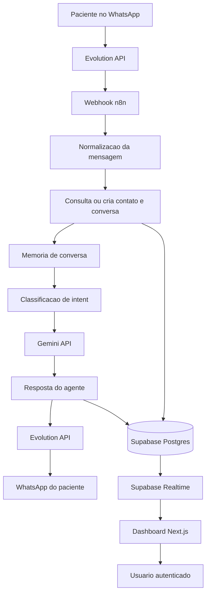

# Arquitetura

## Visão geral

O SorrisoBot AI será composto por dois blocos principais:

- Um agente de atendimento automatizado via WhatsApp, orquestrado pelo n8n.
- Um dashboard web em Next.js, conectado à mesma base Supabase usada pelo agente.

A arquitetura foi pensada para manter o fluxo de automação separado da camada de visualização, mas com uma base de dados compartilhada como fonte única de verdade. Assim, todas as mensagens processadas pelo agente poderão ser acompanhadas no dashboard com status, métricas e atualização em tempo real.

## Fluxo do agente WhatsApp

1. O paciente envia uma mensagem para o WhatsApp da Clínica Sorriso Vivo.
2. A Evolution API recebe a mensagem e dispara um webhook para o n8n.
3. O n8n normaliza os dados da mensagem.
4. O fluxo identifica o contato, recupera ou cria a conversa no Supabase.
5. O agente consulta o histórico recente para aplicar memória de conversa.
6. A mensagem é classificada por intent, como agendamento, reagendamento, dúvida, preço, emergência, localização ou atendimento humano.
7. Quando necessário, o fluxo consulta fontes auxiliares, como base de conhecimento, agenda ou regras da clínica.
8. O Gemini API gera uma resposta adequada ao contexto.
9. O n8n envia a resposta pelo WhatsApp usando a Evolution API.
10. A conversa, mensagens, intent, status e metadados são registrados no Supabase.

## Fluxo do dashboard

1. O usuário acessa o dashboard web.
2. O Next.js autentica o usuário por meio do Supabase Auth.
3. O dashboard consulta conversas, mensagens, status e métricas no Supabase.
4. A interface exibe lista de conversas reais, filtros, gráficos e indicadores.
5. Alterações feitas pelo agente são refletidas em tempo real usando Supabase Realtime.
6. O usuário pode acompanhar conversas abertas, encerradas, transferidas para humano ou pendentes de ação.

## Componentes principais

- **WhatsApp**: canal de entrada e saída das mensagens dos pacientes.
- **Evolution API**: camada de integração entre WhatsApp e automações externas.
- **n8n**: orquestrador dos fluxos de atendimento, classificação, memória e persistência.
- **Gemini API**: modelo de IA usado para interpretar mensagens e gerar respostas.
- **Supabase Postgres**: banco de dados central para conversas, mensagens, contatos, intents e status.
- **Supabase Auth**: autenticação planejada para o dashboard.
- **Supabase Realtime**: atualização em tempo real das conversas e métricas.
- **Next.js**: aplicação web do dashboard.
- **Vercel**: hospedagem pública do dashboard.
- **GitHub Actions**: automações futuras de CI/CD.

## Decisões técnicas iniciais

- Usar um monorepo para manter dashboard, workflows, documentação, prompts e estrutura do Supabase no mesmo repositório.
- Manter o n8n como responsável pela automação principal, evitando acoplar regras de atendimento ao dashboard.
- Usar Supabase como fonte única de verdade para conversas reais e métricas.
- Priorizar evolução incremental: primeiro estrutura e documentação, depois banco, workflow, dashboard e deploy.
- Não versionar segredos, tokens ou credenciais.
- Documentar o uso de IA no desenvolvimento por meio do Vibe Coding Journal.

## Diagrama textual

